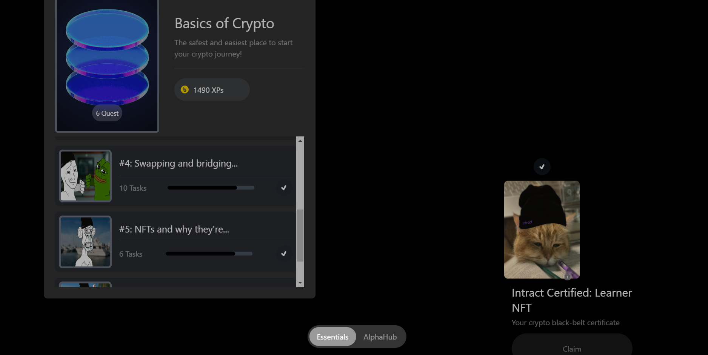
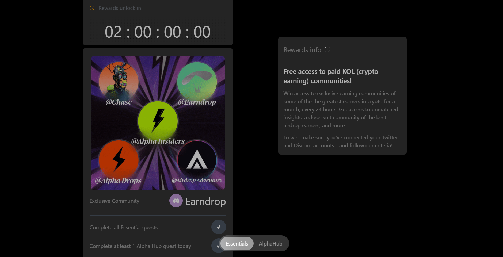
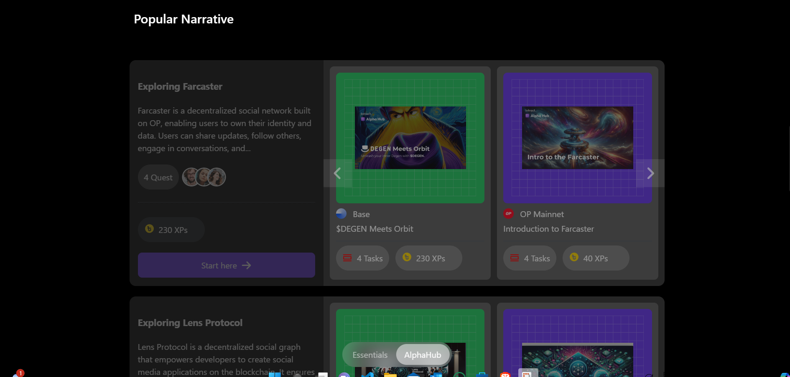
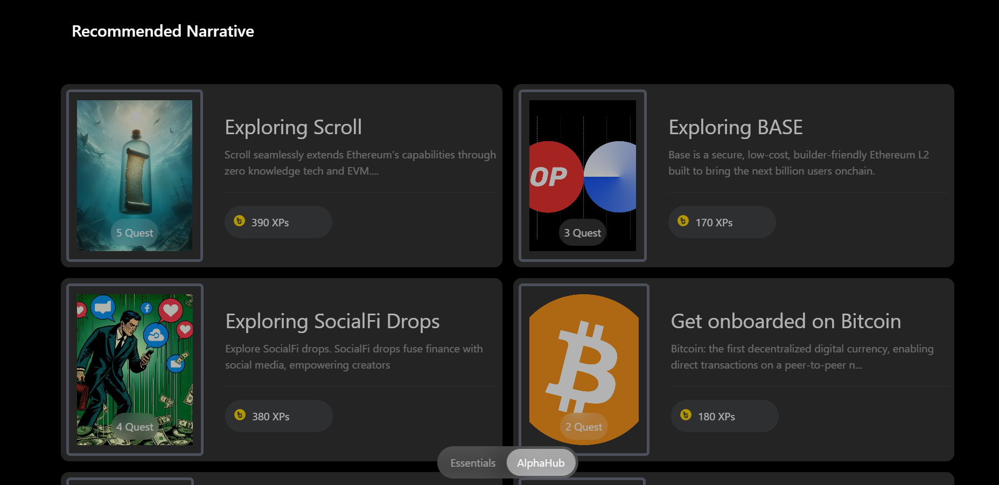
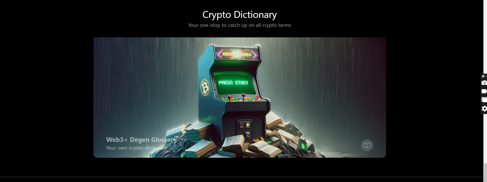
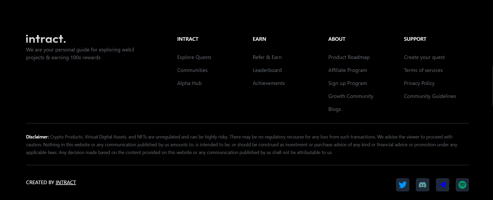

# IntractUI

Explore our Academy page where learning meets innovation. Navigate seamlessly through essential tools like the Banner, RoadMap, Timer, and Dictionary. Engage with curated updates and explore diverse narratives in our Popular Narratives section with intuitive sliders. Discover the Alpha Hub for deeper insights and switch effortlessly between categories. Crafted with Tailwind CSS and React JS for a fluid and responsive experience.

# Link

https://intract-ui.netlify.app/academy

# Snippets

# Tech Stacks

React-Vite, Javascript, TailwindCSS

# Instructions

To start, clone the repository by executing the command: "git clone [https://github.com/ay690/intract_UI.git]". After cloning, navigate into the repository directory and install dependencies using the command "npm install". Once the installation is complete, run the code with "npm run dev". Ensure to execute these commands in your terminal.
